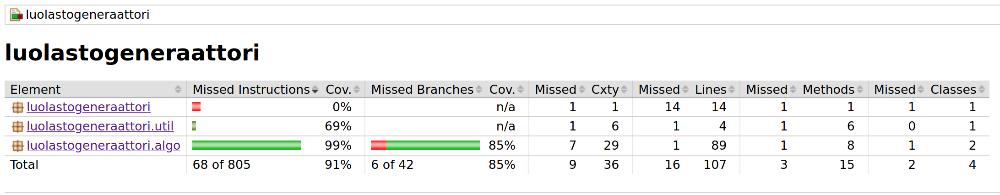

# Testaus

## Testien ajaminen

Yksikkötestit (JUnit) juuresta komennolla 
```shell
~$ cd luolastogen
~/luolastogen$ ./gradlew test
```

Tyylitarkastus juuresta komennolla 

```shell
~/luolastogen$ ./gradlew detekt
```
## Yksikkötestauksen kattavuus

Viimeisimmän tilanteen testikattavuudesta saa generoitua yksikkötestikomennolla.

Komento luo Jacoco-raportin kohteeseen `build/jacocoHtml/index.html`

Lisäksi Detektin ajaminen luo raportin kohteeseen `build/reports/detekt/detekt.html`

## Mitä, miten ja millaisilla syötteillä on testattu

Tällä hetkellä Wilsonin algoritmia testataan ruudukon alustuksen sekä labyrintin muodostuksen läpimenon osalta. Lisäksi
tarkistetaan, että ruudukossa kukin ruutu on liitetty osaksi labyrinttia.Tehokkuutta testataan siten, että labyrintin 
muodostus on ympäröity ajastimella, joka mittaa muodostamiseen kuluneen ajan millisekunneissa. Tulos näytetään lopuksi 
käyttäjälle parametrien kera.

## Jacoco-raportti

Viimeisin raportti näyttää tältä:


