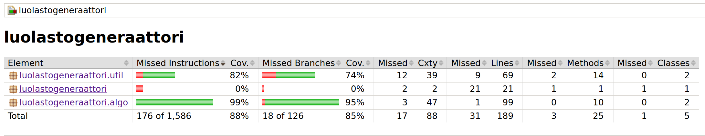

# Testaus

## Testien ajaminen

Yksikkötestit (JUnit) juuresta komennolla 
```shell
~$ cd luolastogen
~/luolastogen$ ./gradlew test
```

Tyylitarkastus juuresta komennolla 

```shell
~/luolastogen$ ./gradlew detekt
```
## Yksikkötestauksen kattavuus

Viimeisimmän tilanteen testikattavuudesta saa generoitua yksikkötestikomennolla.

Komento luo Jacoco-raportin kohteeseen `build/jacocoHtml/index.html`

Lisäksi Detektin ajaminen luo raportin kohteeseen `build/reports/detekt/detekt.html`

## Mitä, miten ja millaisilla syötteillä on testattu

### JUnit

Tällä hetkellä kumpaakin algoritmia testataan seuraavilla menetelmillä:

- Kokeillaan onnistuuko algoritmi työskentelemään alusta loppuun asti kaatumatta ja palauttamalla jonkinlaisen verkon.
- Tarkistetaan liittääkö algoritmi verkon jokaisen solmun osaksi polkua.
- Kokeillaan algoritmin ajamista useilla satunnaisilla syötteillä toimivuusmielessä.

### Suorituskyky

- Tehokkuutta testataan siten, että labyrintin muodostus on ympäröity ajastimella, joka mittaa muodostamiseen kuluneen 
ajan millisekunneissa. Tulos näytetään lopuksi käyttäjälle parametrien kera.

- Ohessa yksittäisajojen mukaisia suoriutumisaikoja eri kokoisilla verkoilla. Kokeilin ajattaa testauksen lähtöpisteestä 
resetoimalla luupissa useamman kerran laskeakseni keskiarvoa suoriutumisajoista, mutta projekti vaikutti hyödyntävän 
välimuistia optimoidakseen suoritusta. Näin ollen allaolevat lukemat ovat varsin naiiveja, mutta antavat suuntaa.

|         |10*10(ms)|25*25(ms)|50*50(ms)|75*75(ms)|100*100(ms)|200*200(ms)|500*500(ms)|
|---------|:-------:|:-------:|:-------:|:-------:|:---------:|:---------:|:---------:|
| Wilson  | 18      | 25      | 79      | 198     | 248       | 2047      | 108537    |
| RanPrim | 17      | 21      | 34      | 63      | 118       | 458       | 6527      |

- Taulukosta voi todeta satunnaistetun Primin olevan lähtökohtaisesti tehokkaampi kuin Wilsonin. Ero korostuu
suuremmilla verkoilla.

## Jacoco-raportti

Viimeisin raportti näyttää tältä ohessa. Yritin poistaa tarkistuksen _luolastogeneraattori_-paketissa olevan pääluokan
`Main.kt` osalta, mutta se osoittautui erittäin monimutkaiseksi. Näin ollen se laskee testikattavuutta hieman.


