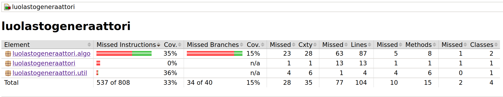

# Testaus

## Testien ajaminen

Yksikkötestit (JUnit) juuresta komennolla `./gradlew test`.

Tyylitarkastus juuresta komennolla `./gradlew detekt`.

## Yksikkötestauksen kattavuus

Viimeisimmän tilanteen testikattavuudesta saa generoitua komennolla `./gradlew test` juurihakemistossa.

Komento luo Jacoco-raportin kohteeseen `build/jacocoHtml/index.html`

Lisäksi Detektin ajaminen luo raportin kohteeseen `build/reports/detekt/detekt.html`

## Mitä on testattu, miten ja millaisilla syötteillä

Toistaiseksi konkreettisella tasolla ei mitään merkittävää (pl. ruudukon luonti) ensimmäisen algoritmin ollessa
keskeneräinen.

## Jacoco-raportti

Viimeisin raportti näyttää tältä:

